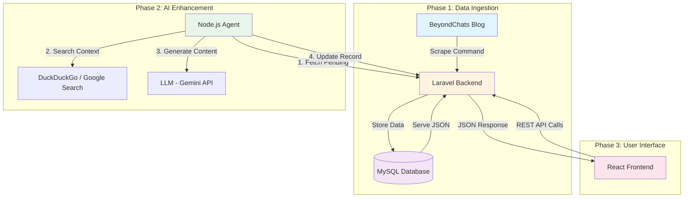

# BeyondChats Technical Assignment

Full-stack AI content pipeline combining a Laravel backend, a Node.js research/LLM agent, and a React (Vite) frontend.

## 📋 Table of Contents

- [Overview](#overview)
- [System Architecture](#system-architecture)
- [Project Structure](#project-structure)
- [Prerequisites](#prerequisites)
- [Local Setup Instructions](#local-setup-instructions)
- [Assignment Requirements](#assignment-requirements)
- [Deployment Status](#deployment-status)
- [Key Features](#key-features)
- [Technology Stack](#technology-stack)

## Overview

This repository contains a complete solution implementing a three-phase AI content enhancement system:

1. **Phase 1: Data Ingestion** - Scrapes articles from BeyondChats blog and stores them in MySQL
2. **Phase 2: AI Enhancement** - Research agent that enriches content using web searches and LLM rewrites
3. **Phase 3: User Interface** - Responsive React frontend for browsing enhanced articles

## System Architecture



### Data Flow

1. **Scraping**: Laravel command crawls BeyondChats blog using DomCrawler
2. **Storage**: Articles stored in MySQL with metadata (title, content, author, date, URL)
3. **Research**: Node.js agent fetches pending articles and searches web for context
4. **Enhancement**: LLM (Gemini) rewrites content with additional context
5. **Update**: Enhanced content pushed back to database
6. **Presentation**: React frontend fetches and displays articles via REST API

## Project Structure

```
beyondchats-assignment/
├── backend/                          # Laravel API Server
│   ├── app/
│   │   ├── Console/Commands/
│   │   │   └── ScrapeArticles.php   # Custom scraper command
│   │   ├── Http/Controllers/
│   │   │   └── ArticleController.php # REST API controller
│   │   └── Models/
│   │       └── Article.php          # Eloquent model
│   ├── database/migrations/
│   │   └── create_articles_table.php # Database schema
│   ├── routes/
│   │   └── api.php                  # API route definitions
│   └── config/
│       └── cors.php                 # CORS configuration
│
├── node-agent/                       # AI Research Agent
│   ├── index.js                     # Core research & rewrite script
│   ├── package.json                 # Node dependencies
│   └── .env.example                 # Environment configuration
│
└── frontend/                         # React + Vite UI
    ├── src/
    │   ├── App.jsx                  # Main router
    │   ├── components/
    │   │   ├── ArticleList.jsx      # Article grid component
    │   │   └── ArticleDetail.jsx    # Article reader component
    │   └── index.css                # Tailwind CSS v4 styles
    └── package.json                 # Frontend dependencies
```

## Prerequisites

Before setting up the project, ensure you have the following installed:

- **PHP** 8.x or higher
- **Composer** (latest version)
- **Node.js** LTS (18.x or higher)
- **npm** (comes with Node.js)
- **MySQL** 5.7+ or 8.x

## Local Setup Instructions

### Step 1: Clone the Repository

```bash
git clone https://github.com/aarabii/BeyondChatsAssignment.git
cd beyondchats-assignment
```

### Step 2: Backend Setup (Laravel)

1. **Navigate to backend directory:**

   ```bash
   cd backend
   ```

2. **Install PHP dependencies:**

   ```bash
   composer install
   ```

3. **Configure environment:**

   ```bash
   # Linux/Mac
   cp .env.example .env

   # Windows
   copy .env.example .env
   ```

4. **Update database credentials in `.env`:**

   ```env
    DB_CONNECTION=mysql
    DB_HOST=127.0.0.1
    DB_PORT=3306
    DB_DATABASE=beyondchats_db
    DB_USERNAME=root
    DB_PASSWORD=
   ```

5. **Generate application key:**

   ```bash
   php artisan key:generate
   ```

6. **Run database migrations:**

   ```bash
   php artisan migrate
   ```

7. **Scrape initial data (Phase 1):**

   ```bash
   php artisan scrape:articles
   ```

8. **Start the Laravel server:**

   ```bash
   php artisan serve
   ```

   The API will be available at `http://127.0.0.1:8000`

### Step 3: AI Agent Setup (Node.js)

1. **Open a new terminal and navigate to node-agent:**

   ```bash
   cd node-agent
   ```

2. **Install dependencies:**

   ```bash
   npm install
   ```

3. **Configure environment:**

   ```bash
   # Create .env file
   touch .env  # Linux/Mac
   # OR
   type nul > .env  # Windows
   ```

4. **Add configuration to `.env`:**

   ```env
   LARAVEL_API_URL=http://127.0.0.1:8000/api/articles
   GEMINI_API_KEY=your_gemini_api_key_here
   USE_MOCK_MODE=true
   ```

   > **Note:** Set `USE_MOCK_MODE=false` to use real API calls with valid keys.

5. **Run the AI agent (Phase 2):**

   ```bash
   node index.js
   ```

   The agent will fetch the latest article, perform research, and update the database.

### Step 4: Frontend Setup (React + Vite)

1. **Open a new terminal and navigate to frontend:**

   ```bash
   cd frontend
   ```

2. **Install dependencies:**

   ```bash
   npm install
   ```

3. **Start the development server:**

   ```bash
   npm run dev
   ```

   The application will be available at `http://localhost:5173`

### Step 5: Verify the Setup

1. Ensure MySQL is running
2. Confirm Laravel API is accessible at `http://127.0.0.1:8000/api/articles`
3. Check that the React frontend loads successfully
4. Verify that articles appear in the UI

## Deployment Status

> **⚠️ WARNING: Not Deployed**

This project is designed for **local execution only** and does not have a live demo link.

### Reason for Local-Only Deployment

The Node.js AI agent (Phase 2) requires **Puppeteer** (Headless Chrome) to perform Google and DuckDuckGo searches. This dependency presents several challenges for standard hosting:

- **Resource Intensive**: Puppeteer bundles a full Chromium browser (~170-300MB), exceeding typical free-tier limits
- **Memory Requirements**: Headless browser instances require 200-500MB RAM per instance
- **Execution Timeouts**: Web scraping operations often exceed the 10-30 second timeout limits on free platforms (Vercel, Netlify, Render free tier)
- **Binary Compatibility**: Chromium binaries require specific system dependencies not always available in serverless environments

## Key Features

- **Automated Scraping**: Custom Artisan command for crawling BeyondChats blog
- **AI-Powered Enhancement**: Context-aware content enrichment using web research and LLM
- **RESTful API**: Clean Laravel API with CORS support
- **Modern Frontend**: Responsive React UI with Tailwind CSS v4
- **Mock Mode**: Test without API keys using simulated responses
- **Monorepo Structure**: All components organized in a single repository

## Technology Stack

### Backend

- **Framework**: Laravel 10.x
- **Language**: PHP 8.x
- **Database**: MySQL
- **Scraping**: Symfony DomCrawler
- **API**: RESTful JSON endpoints

### AI Agent

- **Runtime**: Node.js
- **Web Automation**: Puppeteer
- **LLM**: Google Gemini API
- **Search**: DuckDuckGo/Google

### Frontend

- **Framework**: React 18
- **Build Tool**: Vite
- **Styling**: Tailwind CSS v4
- **HTTP Client**: Fetch API
- **Routing**: React Router

---

## 📝 Notes

- **Mock Mode**: The Node.js agent defaults to `USE_MOCK_MODE=true` for easy testing without API keys
- **Database**: Ensure MySQL is running before starting any component
- **CORS**: Already configured for `localhost:5173` ↔ `127.0.0.1:8000` communication
- **API Keys**: Obtain a Gemini API key from Google AI Studio for production use
